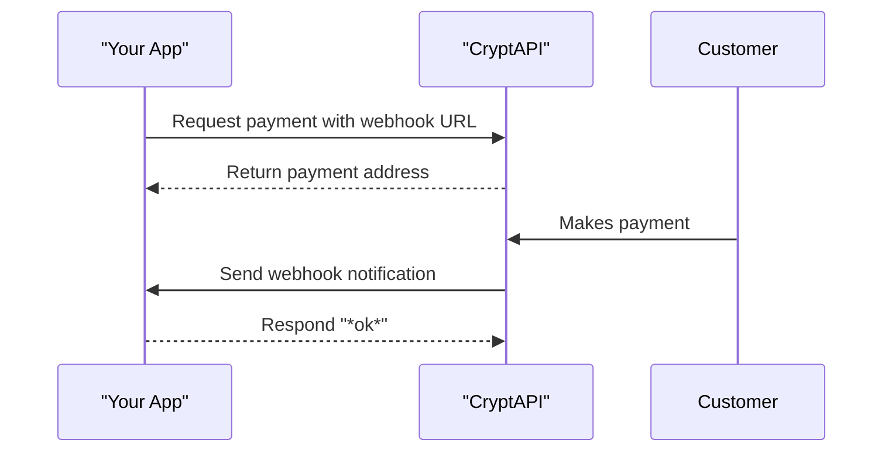

# How Webhooks Work

Webhooks (also called callbacks or IPNs) are how CryptAPI sends real-time notifications to your application. Instead of you needing to constantly check our API for updates, we will notify your server instantly when a payment is received, confirmed, or when other important events happen.

## How Webhooks Work



## 1. Create a Webhook Endpoint

First, you need to create an endpoint (a URL) in your application that can receive our notifications. This endpoint must:

- Be publicly accessible over HTTPS.
- Be able to receive `POST` requests.
- Respond with a `200` HTTP status code and a plain text body containing only `*ok*` to acknowledge receipt. Any other response will be considered a failure.

## 2. Provide the Endpoint URL to CryptAPI

When you make an API request to create a payment, deposit, or subscription, you'll provide your endpoint URL in the `callback` parameter (Custom Payment Flow). Make sure to URL-encode it if you add your own query parameters.

```bash
# Example for Custom Payment Flow
curl "https://api.cryptapi.io/btc/create/?callback=https://yoursite.com/webhook"
```

> **TIP**
>**URL Encode your webhook URL** if it contains its own query parameters. For example, `https://yoursite.com/webhook?order_id=123` becomes `https%3A//yoursite.com/webhook%3Forder_id%3D123`.


> **INFO**
>Custom parameters you append to the webhook URL (e.g., `order_id`, `user_id`) are delivered as URL query parameters in the webhook request. Read them from the query string in your handler, even if you configured `post=1` and/or `json=1`.


```javascript
const originalUrl = 'https://yoursite.com/webhook?order_id=123';
const encodedUrl = encodeURIComponent(originalUrl);
// encodedUrl: "https%3A%2F%2Fyoursite.com%2Fwebhook%3Forder_id%3D123"
```

```php
<?php
$originalUrl = 'https://yoursite.com/webhook?order_id=123';
$encodedUrl = urlencode($originalUrl);
// $encodedUrl is "https%3A%2F%2Fyoursite.com%2Fwebhook%3Forder_id%3D123"
?>
```

```python
import urllib.parse

original_url = 'https://yoursite.com/webhook?order_id=123'
encoded_url = urllib.parse.quote(original_url, safe='')
# encoded_url is "https%3A%2F%2Fyoursite.com%2Fwebhook%3Forder_id%3D123"
```

```ruby
require 'uri'

original_url = 'https://yoursite.com/webhook?order_id=123'
encoded_url = URI.encode_www_form_component(original_url)
# encoded_url is "https%3A%2F%2Fyoursite.com%2Fwebhook%3Forder_id%3D123"
```

```cs
using System.Net;

string originalUrl = "https://yoursite.com/webhook?order_id=123";
string encodedUrl = WebUtility.UrlEncode(originalUrl);
// encodedUrl is "https%3A%2F%2Fyoursite.com%2Fwebhook%3Forder_id%3D123"
```

```java
import java.net.URLEncoder;
import java.nio.charset.StandardCharsets;

String originalUrl = "https://yoursite.com/webhook?order_id=123";
String encodedUrl = URLEncoder.encode(originalUrl, StandardCharsets.UTF_8.toString());
// encodedUrl is "https%3A%2F%2Fyoursite.com%2Fwebhook%3Forder_id%3D123"
```

```go
import "net/url"

originalUrl := "https://yoursite.com/webhook?order_id=123"
encodedUrl := url.QueryEscape(originalUrl)
// encodedUrl is "https%3A%2F%2Fyoursite.com%2Fwebhook%3Forder_id%3D123"
```

```curl
# The final API call with the URL-encoded callback parameter
curl "https://api.cryptapi.io/btc/create/?callback=https%3A%2F%2Fyoursite.com%2Fwebhook%3Forder_id%3D123"
```

## 3. Secure Your Endpoint

> **WARNING**
>**CRITICAL: You must verify webhook signatures!** This is essential to ensure that the notification was sent from CryptAPI and has not been tampered with. We provide a detailed guide on how to do this.
> 
> **➡️ [Read the Verify Webhook Signatures Guide](/webhooks/verify-webhook-signature)**


## Webhook Payloads

The data fields included in a webhook notification depend on the CryptAPI service and the event that occurred. For example, a webhook for a new deposit will have different information than a webhook for a completed checkout payment.

Refer to the specific documentation for details on the payload for each type of webhook:

- **[Custom Payment Flow Webhooks](/webhooks/custom-payment-flow-webhooks)**

## Best Practices & Troubleshooting

To ensure your webhook integration is robust, follow these best practices:

-   **Respond Quickly (Within 30 Seconds):** Your endpoint must respond within 30 seconds, otherwise the connection will time out. Acknowledge webhooks by sending a `200` response with `*ok*` immediately. For any processing that might take longer, use a background job queue to handle it asynchronously after you've sent the response.
-   **Handle Retries with Idempotency:** If your endpoint fails to respond with `*ok*`, CryptAPI will retry sending the notification. Because of this retry mechanism, your endpoint might receive the same webhook multiple times. To prevent processing the same event more than once, your endpoint must be idempotent. You can achieve this by logging the `uuid` of processed webhooks and ignoring any that have already been handled.
-   **Whitelist CryptAPI IPs:** If you use a firewall, whitelist CryptAPI's sending IPs to ensure you receive notifications: `51.77.105.132` and `135.125.112.47`.
-   **Use `ngrok` for Local Testing:** `ngrok` is a great tool for exposing your local development server to the internet, allowing you to test webhooks without deploying to a public server.

### Retry Schedule
If your endpoint doesn't respond successfully, CryptAPI uses an exponential backoff schedule to retry the notification:
- **First retry**: 6 minutes
- **Second retry**: 12 minutes  
- **Third retry**: 24 minutes
- ...and so on, doubling the time until the transaction is 3 days old.

### Troubleshooting Common Issues
- **Webhooks not received:** This can happen if your webhook URL is not publicly accessible, a firewall or service like Cloudflare is blocking our requests, or if your customer sends a different coin/token than the one the payment address was generated for.
- **Duplicate processing:** As mentioned, this happens when your endpoint doesn't handle retries idempotently. Always check the `uuid` of a webhook before processing it.